# Futoru (フトル) - 増量支援アプリ


<br>


### サービスURL
~~https://futoru-app.duckdns.org~~  
AWS EC2 上でDocker Composeを用いてコンテナ運用しています。  
GitHub Actionsによる CI/CD パイプラインを構築しており、mainブランチへのプッシュで自動デプロイされます。  
（Nginx + Let's Encrypt により常時SSL化済み）

※ 現在はアクセスできないようになってます。


## 目次
1. [概要](#概要)
2. [使用技術](#使用技術)
3. [スクリーンショット](#スクリーンショット)
4. [インフラ構成図](#インフラ構成図)
5. [データベース設計（ER図）](#データベース設計-er図)
6. [環境構築手順](#環境構築手順)


## 概要
Futoru は、体重が増えにくい人のための増量特化型食事管理アプリです。

「痩せる」ためのアプリは多く存在しますが、「太る」ことに特化したサービスはまだ少ないのが現状です。  
本アプリでは、ユーザーの身体情報（身長・体重・年齢・活動レベル）をもとに、  
1日に必要な目標カロリーを自動算出し、日々の食事記録と進捗確認を通じて、無理のない増量をサポートします。

## 使用技術

| カテゴリ | 技術・ツール |
| :--- | :--- |
| 言語 | Java 21 (LTS) |
| フレームワーク | Spring Boot 4.0.1, Spring Security |
| フロントエンド | Thymeleaf, HTML5, CSS3, JavaScript |
| データベース | MySQL 8.0 (Docker Container) |
| インフラ | OCI, Cloudflare, Docker Compose |
| CI/CD | GitHub Actions (自動ビルド・デプロイ) |
| ツール | IntelliJ IDEA, Maven, Git |


## スクリーンショット

### 日々の記録（メイン機能）
|                                               ホーム                                               |                                              体重記録                                               |
|:-----------------------------------------------------------------------------------------------:|:-----------------------------------------------------------------------------------------------:|
|         <a href="docs/images/home.png">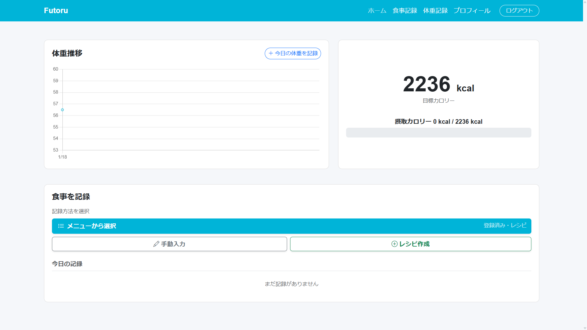</a>         | <a href="docs/images/weight-input.png">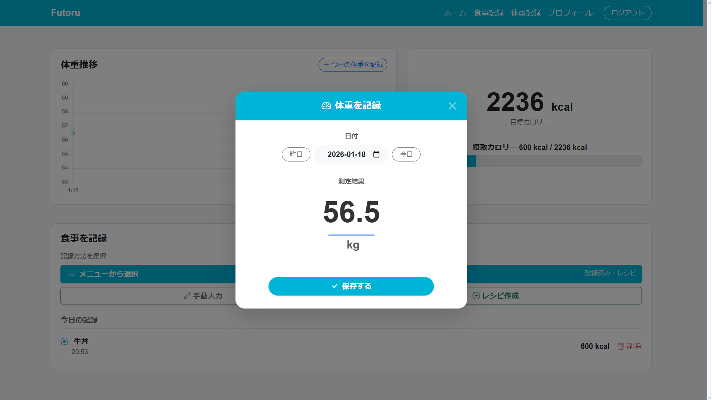</a> |
|                                            **食事記録**                                             |                                            **食事記録後**                                            |
|   <a href="docs/images/meal-input.png">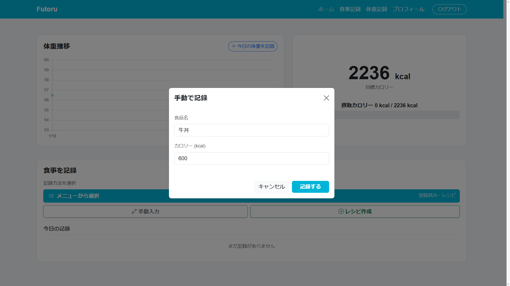</a>   |     <a href="docs/images/meal-log.png">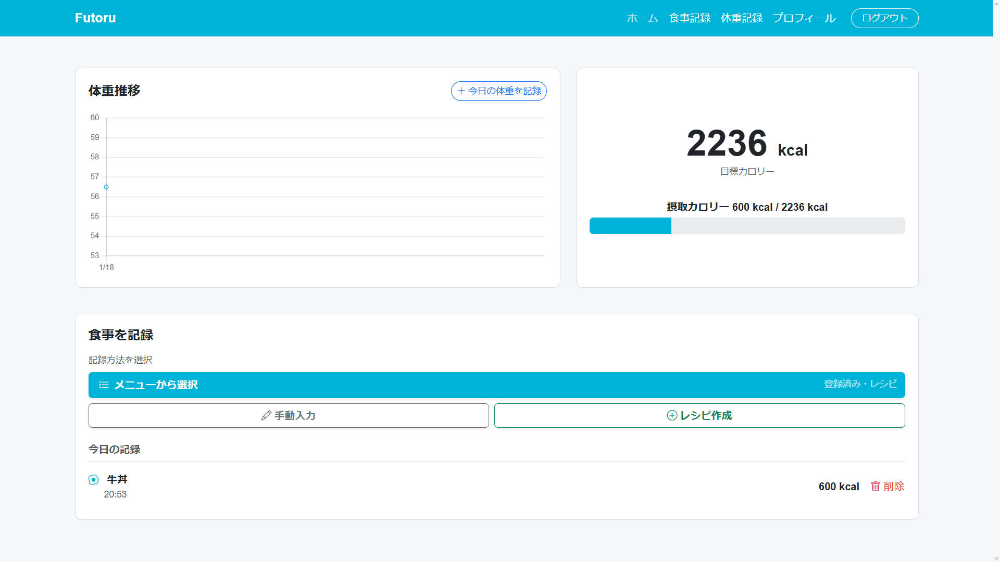</a>     |
|                                            **体重管理**                                             |                                            **レシピ登録**                                            |
|<a href="docs/images/weight-chart.png">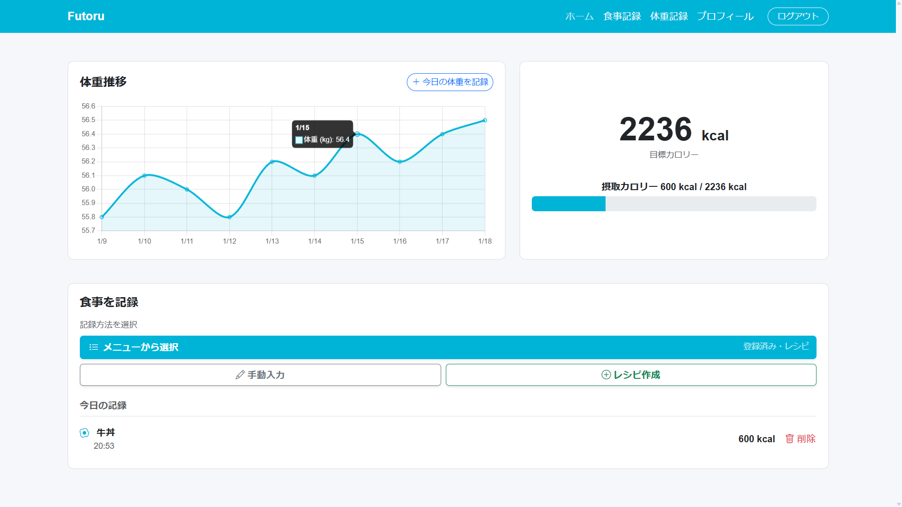</a> |       <a href="docs/images/recipe.png">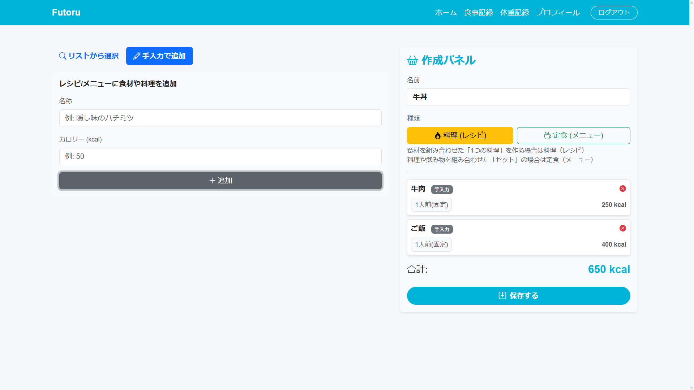</a>       |

### アカウント管理
| ログイン | 新規登録 | 登録入力 |
| :---: | :---: | :---: |
| <a href="docs/images/login.png">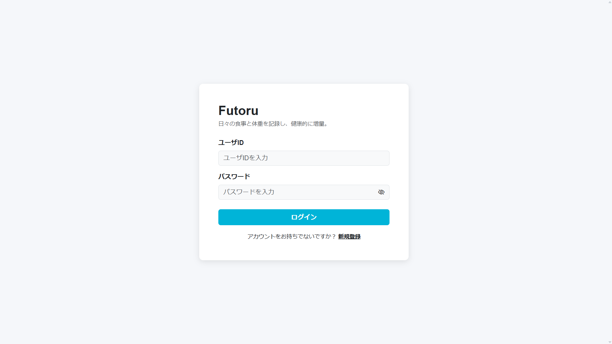</a> | <a href="docs/images/register-empty.png">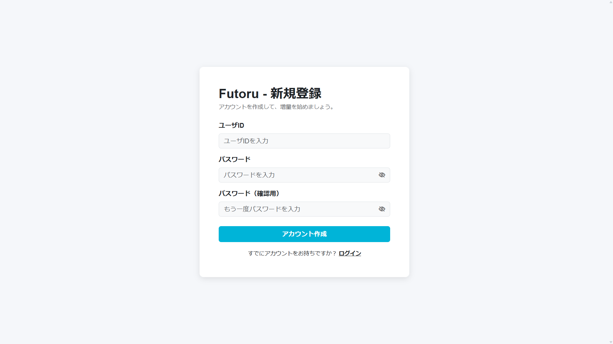</a> | <a href="docs/images/register-input.png">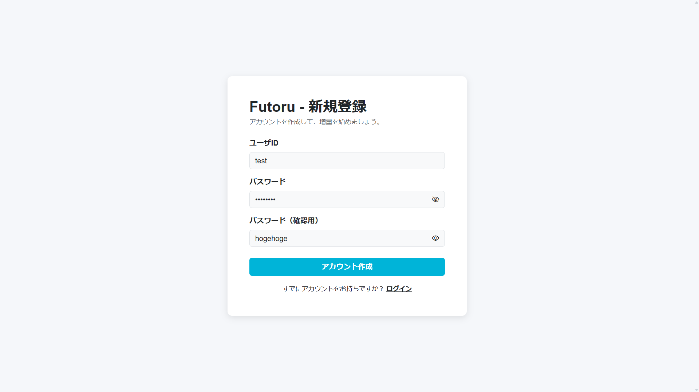</a> |

### 工事中
<a href="docs/images/under-construction.gif">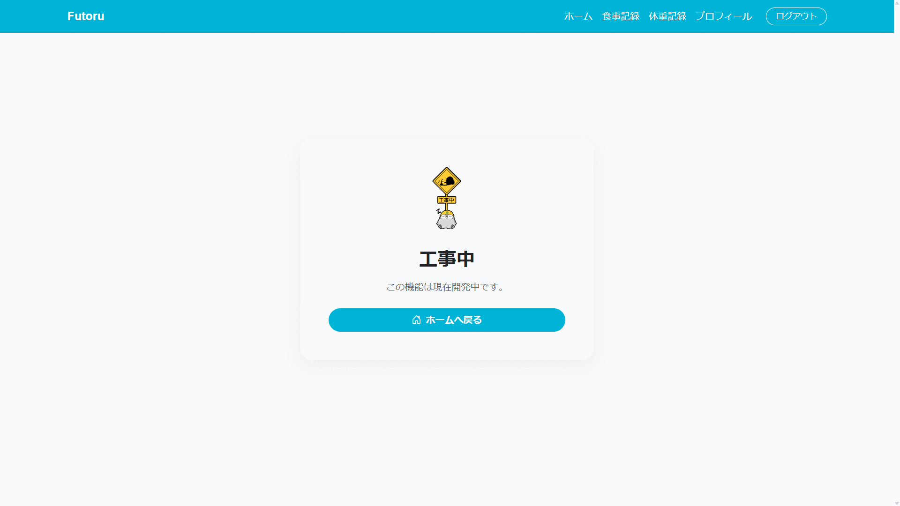</a>

## インフラ構成図
AWS EC2インスタンス内に Docker Compose 環境を構築し、Nginx をリバースプロキシとして配置しています。  
アプリケーションとデータベースは内部ネットワークで接続され、外部からの直接アクセスを遮断しています。

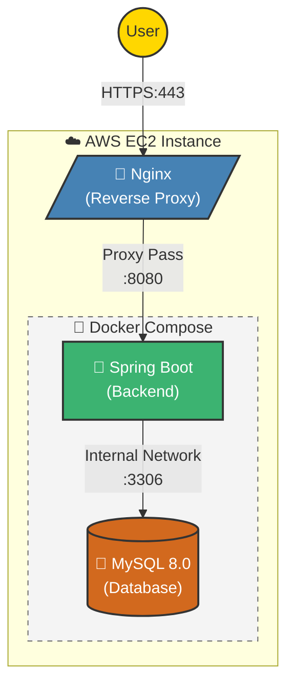
## データベース設計 (ER図)
コンポジットパターンを採用し、食材・料理・定食を統一的に管理しています。  
また、食事記録にはスナップショット方式を採用し、マスタデータが変更されても過去の記録（カロリー計算）が整合性を保つ設計としています。

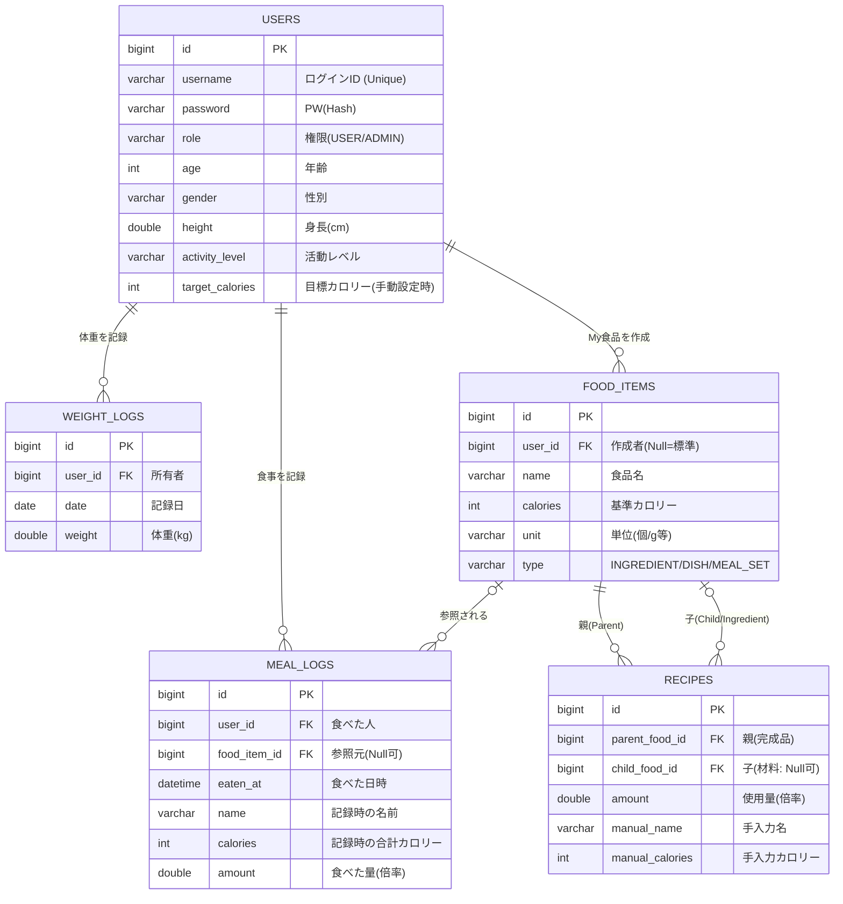

## 環境構築手順
リポジトリをクローンした後、ローカルでアプリを開けるようにする手順です。

### 前提条件
- Java 21（JDK）
- Docker

### 1. バックエンドのビルド
ターミナルで`backend`ディレクトリに移動し、以下のコマンドでバックエンドのビルドをします。
```bash
cd backend
./mvnw clean package -DskipTests
```

### 2. コンテナの起動
ルートディレクトリに移動して、以下のコマンドでコンテナを立ち上げます。
```bash
cd ..
docker compose -f docker-compose.local.yml up -d
```
ブラウザで`http://localhost:8080`にアクセスすればアプリを開くことができます。

#### ログを確認したい場合
以下のコマンドでログを確認できます。
```bash
docker compose logs
```

リアルタイムで表示したい場合はオプション`-f`をつける
```bash
docker compose logs -f
```

### 3. 終了の仕方
コンテナを落とす場合は以下のコマンドを実行します。
```bash
docker compose down
```